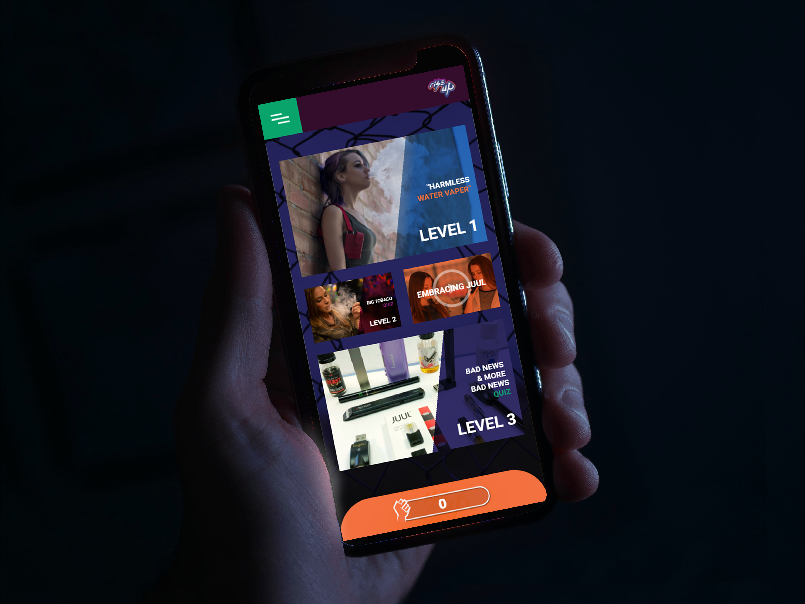

# Rise Up Against Nicotine

## UI Challenge

### [View solution here](https://github.com/VngRay/Product-Design/blob/main/Rise%20Up%20Against%20Nicotine%20UI%20Challenge/Vang_Visual_Thesis_Design_Solution.pdf)

__Roles__
- UX Designer
- UI Designer
- Visual Designer

__Date and Time__
- 10.25.19

__Tools__
- Adobe XD
- Adobe Photoshop
- Adobe Illustrator

---

## The Challenge

The proposed design solution is an UAC or a Universal Ad Campaign aimed to drive users to the app Rise Up: Against Nicotine. The strategy is to use marketing tools that are already effective in targeting the youth and bring information regarding e-cigarettes. The significance of this strategy is to place a parallel on how marketing campaigns delude or create interest for e-cigarette companies.

---

## Discovery & Analysis

The proposed design solution is an UAC or a Universal Ad Campaign[^1] aimed to drive users to the app Rise Up: Against Nicotine. The strategy is to use marketing tools that are already effective in targeting the youth and bring information regarding e-cigarettes. The significance of this strategy is to place a parallel on how marketing campaigns delude or create interest for e-cigarette
companies.

[^1]:Sherwood, Robin. “Universal App Campaigns (UAC): What they are and how to use them Click Z Marketing Technology Transformation, May 22, 2019. https://www.clickz.com/universal-app-campaigns-uac-overview/224195/.

The goal is to use an interactable ad in order to engage users to the campaign. Branded Mini Games is a site that specializes in such ads mostly for videogame applications on the mobile market[^2]. The reason to work with this method is to get the campaign’s attention to those on mobile devices[^3]. In this digital age more than forty-five percent of teens are online constantly on their mobile devices. In order to provide the most reach possible, an app that target’s itself through social media and the different digital store fronts is a feasible solution for today’s youth demographic.

[^2]:Emoji Games GmbH. Branded Mini Games. https://brandedminigames.com/playableads/

[^3]:Anderson, Monica and Jiang, Jingjing. “Teens, Social Media & Technology” Pew Research Center Internet and Technology, May 31, 2018. https://www.pewinternet.org/2018/05/31/teens-social-media-technology-2018/

<i>Nelson Nokela and Chaptr Studio Sticky Fingers E-Juice Rebrand.</i>

<i>Bleeker Terri Nicotine: The danger to children</i>
 

What is communicated through this campaign will revolve around how marketing, branding, and design are shaping the landscape of e-cigarettes. Products such as Juul brand itself as a premium product that is discreet and attractive to the youth.4 Children and teens are unaware to the power of design when it comes these products. An increase of e-cigarette usage amongst teens has been on the rise from year to year with the CDC showing an increase of one-hundred-and-thirty-five percent increase from 2017 to 2019[^5]. Although thiscampaign’s goal is to bring the information to children, it will only be adults that can take necessary steps to solve the nicotine epidemic. What is unique about this campaign is that in order to having genuine and lasting change for nicotine addiction and e-cigarettes, both the youth and adults should be informed to the issues surrounding such products.

[^4]:Chen, Angus. “Teenagers Embrace JUUL, Saying It’s Discreet Enough To Vape In Class” National Public Radio, December 4, 2017. https://www.npr.org/sections/healthshots/2017/12/04/568273801/teenagers-embrace-juul-saying-its-discreet-enough-to-vape-inclass

[^5]:Bach, Laura. “Electronic Cigarettes and Youth.” Campaign for Tobacco-Free Kids, pp. 1–6. https://www.tobaccofreekids.org/assets/factsheets/0382.pdf

Inspiration and visual ideas for this campaign can be located to these artists and groups. The first Addressing Youth and Nicotine Addiction Center for Learning & Innovation’s site and campaign Still Blowing Smoke[^6], second Sticky Fingers E-Juice Rebrand[^7] by Chaptr Studio and Nelson Nokela, and Liquid Nicotine: The danger to children[^8] by Terri Bleeker. These designs will set in motion the general aesthetic of the application, web-design, and campaign for Rise Up. The seamless grid of Still Blowing Smoke connects the various studies and testimonies in order to drive a holistic experience on the desktop browser,Sticky Fingers Re-branding sets a design style for the mobile interactive ad and Terri Bleeker’s use of an info-graphic poster simplifies the mass amount of information into recognizable symbols.

[^6]:Population Health Division San Francisco Department of Public Health. Still Blowing Smoke August 27, 2015. Behance. https://www.behance.net/gallery/29048105/Addressing-Youth-and-Nicotine-Addiction?tracking_source=search%7Cnicotine and https://stillblowingsmoke.org/

[^7]:Nokela, Nelson and Chaptr Studio. Sticky Fingers E-Juice Rebrand August 19, 2019. Product Design. Behance. https://www.behance.net/gallery/84069821/Sticky-Fingers-E-Juice-Rebrand?tracking_source=search-all%7Cvape

[^8]:Terri Bleeker. Nicotine: The danger to children March 11, 2015. Digital, Infographic Poster. Behance. https://www.behance.net/gallery/24394299/Liquid-Nicotine-The-danger-to-children?tracking_source=search%7Cnicotine.

---

## Sketches and Ideation

<i>Social media interactive advertisement sketch.</i>

<i>Social media interactive advertisement sketch.</i>

<i>Additional notes and user interface sketches.</i>

<i>Feedback loop user journey.</i>

<i>Preliminary sketches of the screens</i>

---

<i>rise up logo</i>

<i>Twitter Post Mockup</i>

<i>Website Landing Page</i>

<i>Facebook Page</i>

---

### [Instagram Interactive Advertisement available here](https://xd.adobe.com/view/56a1ebdb-be29-41d4-4a30-a556d0b316b7-2090/)

<i>Screen 1</i>

<i>Screen 2</i>

<i>Screen 3</i>

<i>Screen 4</i>

---

## Style Guide

|Colors|||
|--|--|--|
|Pomegranate #A105FC 161, 5, 252|Orange #FF4F2E 255, 79, 46|Blueberry #2B71B9 43, 113, 185|
|Grape #322C6E 50, 44, 110|Lime #0BA56C 11, 165, 108|White #FFFFFF 255, 255, 255|
|Rich Black #000000 0,0,0|--|--|

__Fonts__
- Kill the noise
- Noto Sans Condensed Light
- Roboto, Regular, Black

---

## [Solution Available Here](https://github.com/VngRay/Product-Design/blob/main/Rise%20Up%20Against%20Nicotine%20UI%20Challenge/Vang_Visual_Thesis_Design_Solution.pdf)

