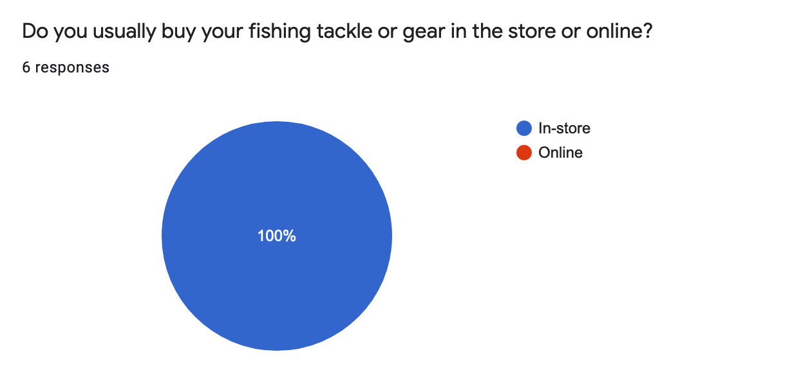
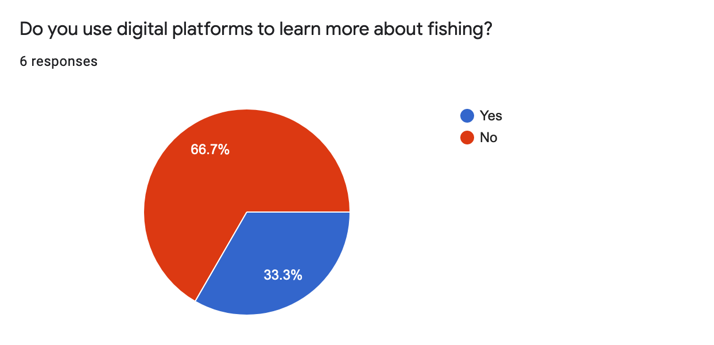
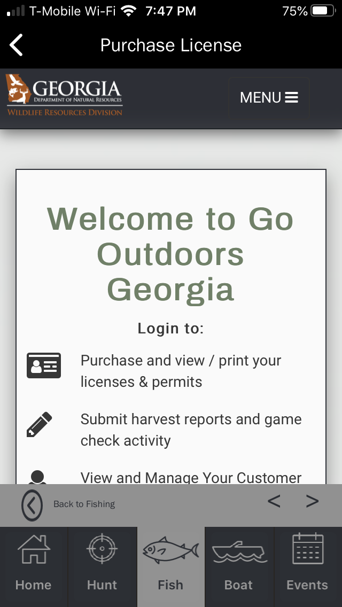
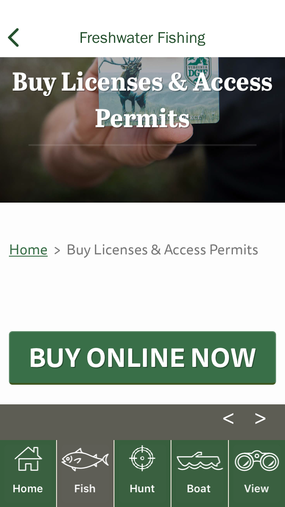
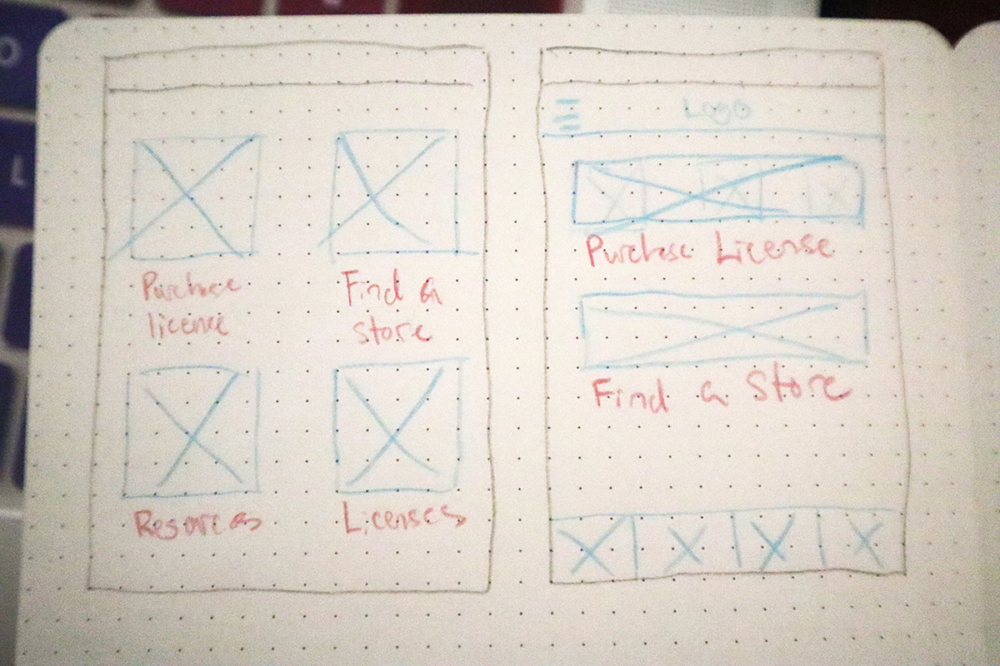
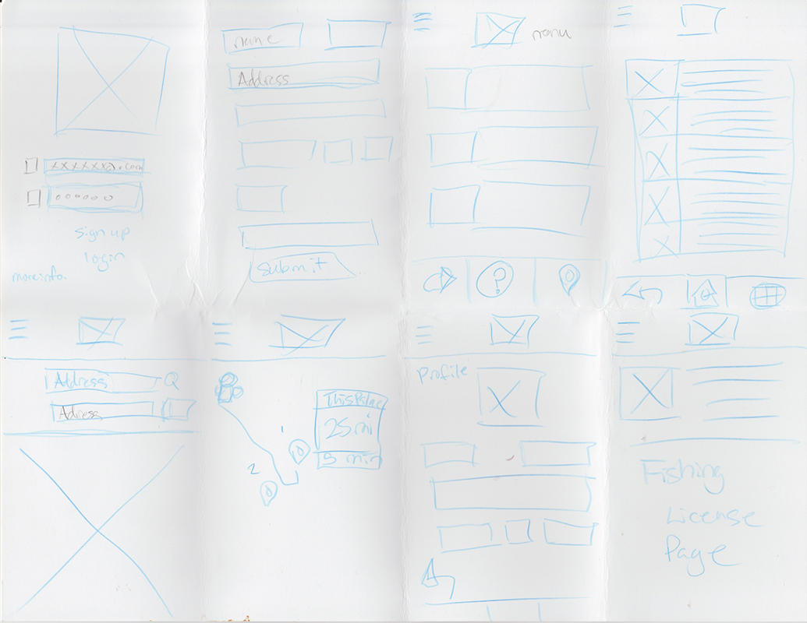
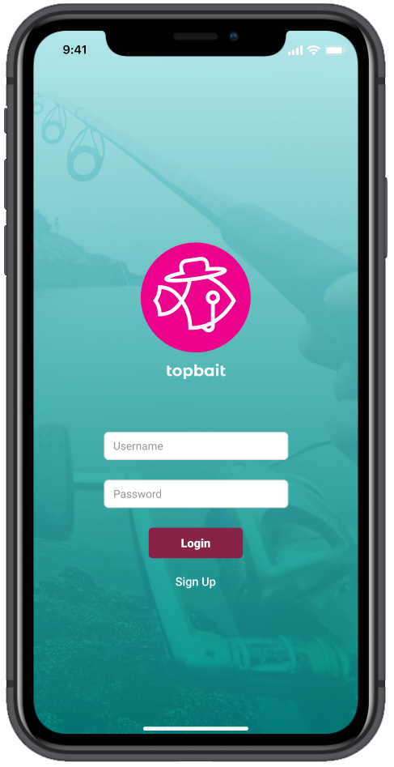
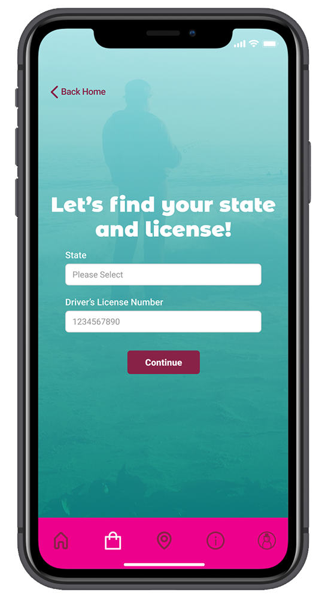
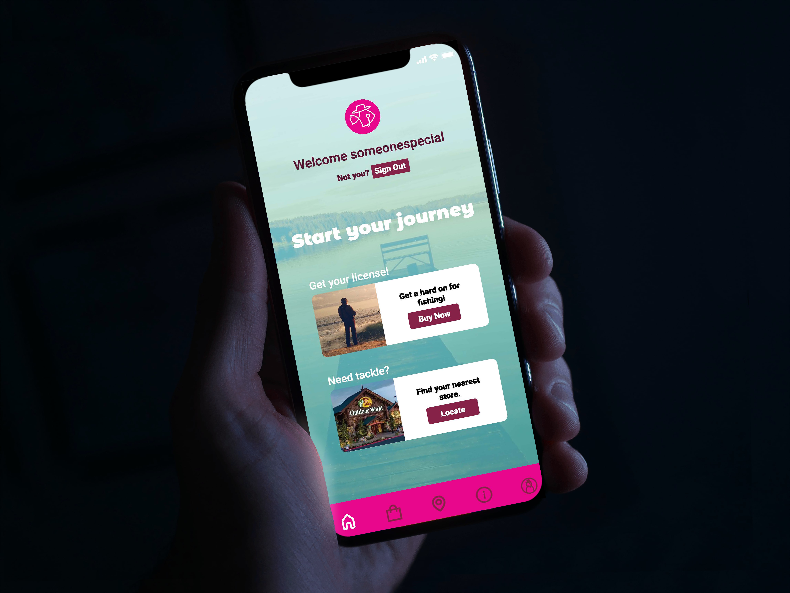

# top bait UX Challenge

[UX Challenge Solution](https://www.figma.com/proto/O8Fmw4f3rLa2lghXY480mg/Udacity-Hi-Fi-Last-Iteration?node-id=129%3A6288&viewport=95%2C151%2C0.05537280812859535&scaling=contain)

## UX Challenge

__Roles__
- UX Researcher
- UX Designer
- UI Designer
- Visual Designer

__Date and Time__
- Three Weeks 4.2020 - 5.2020

__Tools__
- Figma
- Miro 
- Mobbin 
- Zeplin
- Adobe Illustrator
- Lookback
---

## The Challenge

The previous National National Survey of Fishing, Hunting, and Wildlife-Associated Recreation had an increase of near 20%.  I want to create a strong experience moving forward for the growing number of fishermen coming to the sport. 

To achieve this, making the purchasing process more streamlined and more accessible is vital. There are a number of fishermen that still do not use digital products or services to conduct their purchases or research. 

---

## Discovery & Analysis

Nearly a third of respondents use digital tools and platforms for the sport of fishing. Yet, all of the survey responders do not purchase tackle or fishing needs online.

“I usually go to the Walmart and get my license there. It was busy because the were several people in front of me. One guy was getting a gun and I had to wait for an hour.” - Participant 2

<table>
<tr>
    <td></td>
    <td> </td>
</tr>
</table> 

### Competitive Analysis

Through my findings the main issue is that the applications do not have clear avenues for obtaining a fishing license. The experience is different from state to state leaving no familiarity between the product. 

Although a neighboring state such as South Carolina may accept a Georgia fishing license, the apps used between both states vary differently. Apps also point towards online sites instead of being native to the application itself.

<table>
<tr>
    <td></td>
    <td> </td>
</tr>
</table> 

---

## Concepts and Insights

|__Make an accessible interface and minimal interface__|__Provide only the information users actually need before they fish__|__Users need to find their fishing stores__|
|:---|:---|:---|
|By providing a design that is minimal, users can achieve their goals more effectively.|It is not reliable to be on a fishing trip and depend on a cellular device. Fishing trips can be long.|When it comes down to it fishermen still rely heavily to get their information, tackle, and bait from a physical location.|

---

## Sketches and Ideation

Affinity Diagram, Early Sketch, and Crazy-8 Sketches

<table>
<tr>
    <td></td>
    <td></td>
    <td></td>
</tr>
</table>

---

## Prototyping

Development regarding login and accessibility was a concern for many of the fishermen in the surveys and interviews. The low fidelity prototype reflects these concerns and aims to remedy the issue before moving into the other functions.

<table>
<tr>
    <td></td>
    <td></td>
    <td></td>
</tr>
</table>

## Validation, Usability, Feedback

|__Usuability__|__Feedback__|__Insight__|
|:---|:---|:---|
|Participants attended a self user test with instructions to test usability.|<i>“What I need from this app is my license. I do not want to wait so long.” –  From a participant that felt as if the application was unclear   “I don’t need the app looking like a game.” –  From a participant that expressed frustration</i>|Sending off the low-fidelity designs gave more information regarding the flow of the design. An insight gained is that fishermen need a quick way to identify their needs, otherwise they lose interest.|

---

## Style Guide

|Colors|||
|--|--|--|
|White #FFFFFF 255, 255, 255|Black #000000 0, 0, 0|Hot pink #EC008C 236, 0, 140|
|Grape purple #5B1834 91, 24, 52|Darkish purple #882347 136, 35, 71|Rust red #BA1100 186, 17, 0|

__Fonts__
- Montserrat Alternates, Bold, Black
- Roboto, Regular, Medium, Black

---

## Iteration

With the insights, feedback, and usability a finalized iteration of topbait included an optimized flow for users, direct buttons, increased legibility, error pages, and an extended screen.

## High-Fidelity Prototype

[Experience the design on Figma](https://www.figma.com/proto/O8Fmw4f3rLa2lghXY480mg/Udacity-Hi-Fi-Last-Iteration?node-id=129%3A6288&viewport=95%2C151%2C0.05537280812859535&scaling=contain)

<table>
<tr>
    <td></td>
    <td></td>
</tr>
</table>

---

## Solution and Impact

Topbait provides a clearer and easier flow and accessibility for all types of users. The impact of having an application with this much ease of use can increase the amount of new fishermen for the upcoming years.

